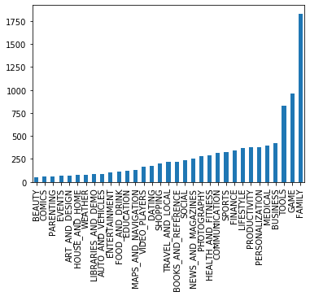
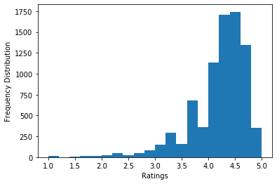
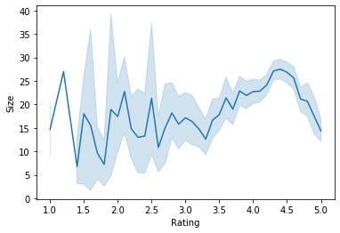
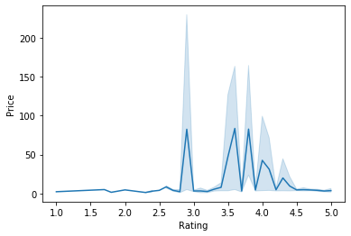
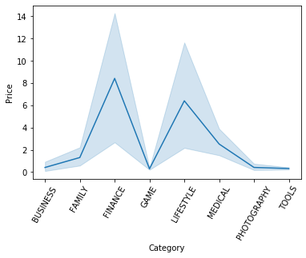
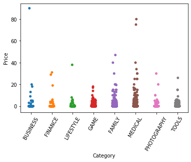
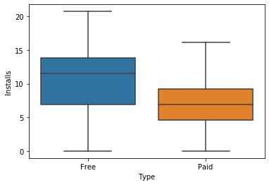
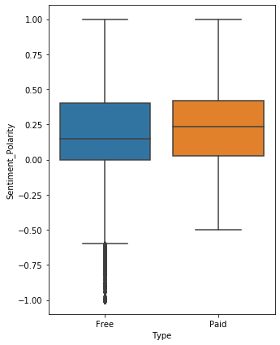

# Google Play Store App Analysis

**Author:** Sameer Anees Jaliawala  
**Institution:** Habib University  
**Program:** Data Science Case Study  
**Completion Date:** 2018

---

## Source Code
- [Data Science Case Study 2](https://github.com/sameeranees/Data-Science-Case-Study-2)

---

## Project Overview

This project provides a comprehensive analysis of the Android app market by examining over ten thousand applications in Google Play Store across different categories. The analysis focuses on identifying patterns, trends, and insights to develop strategies for app growth and user retention in the competitive mobile app ecosystem.

The study addresses the critical need for data-driven decision making in the mobile app industry, where understanding market dynamics, user behavior, and competitive positioning is essential for success. By analyzing large-scale app data, developers and investors can make informed decisions about app development, marketing strategies, and investment opportunities.

## Dataset and Scope

### Primary Dataset (apps.csv)
Comprehensive analysis of Google Play Store applications:

- **Scale:** 10,000+ applications across all categories
- **Features:** 13 detailed app characteristics including downloads, ratings, reviews, pricing
- **Categories:** Apps spanning various genres from gaming to productivity
- **Metrics:** Comprehensive performance indicators and user engagement data
- **Coverage:** Representative sample of the entire Google Play Store ecosystem

### User Reviews Dataset (user_reviews.csv)
Detailed sentiment analysis of user feedback:

- **Sample Size:** 100 reviews per app (prioritized by helpfulness)
- **Sentiment Analysis:** Pre-processed sentiment classification (Positive, Negative, Neutral)
- **Text Processing:** Cleaned and analyzed review content with polarity and subjectivity scores
- **Coverage:** Comprehensive user feedback across different app categories
- **Quality:** Most helpful reviews prioritized for meaningful insights

## Analysis Methodology

### Exploratory Data Analysis
Comprehensive data profiling and pattern identification:

**Descriptive Statistics:** Detailed analysis of app characteristics, performance metrics, and market distribution across categories and price points.

**Distribution Analysis:** Understanding data patterns, outliers, and market concentration to identify opportunities and challenges in different app segments.

**Correlation Analysis:** Identifying relationships between app features, user engagement, and success metrics to understand key success factors.

**Visualization:** Interactive charts, graphs, and dashboards for intuitive understanding of complex market dynamics and trends.

### Market Analysis Visualizations
The project included comprehensive visualizations to understand the Google Play Store ecosystem:

  
*Pricing strategy analysis and its impact on app success*

  
*User engagement patterns and rating distribution analysis*

### Sentiment Analysis Implementation
Advanced natural language processing for user feedback analysis:

**Text Processing:** Comprehensive cleaning and preprocessing of review text to ensure accurate sentiment analysis and meaningful insights.

**Sentiment Classification:** Automated categorization of user reviews into positive, negative, and neutral sentiments using machine learning techniques.

**Polarity Scoring:** Quantitative measurement of sentiment intensity to understand the strength of user opinions and satisfaction levels.

**Subjectivity Analysis:** Distinction between objective facts and subjective opinions in user reviews to identify genuine user experiences.

### Statistical Analysis and Modeling
Rigorous statistical methods for market insights:

**Hypothesis Testing:** Validation of market assumptions and identification of statistically significant patterns in app performance and user behavior.

**Regression Analysis:** Predictive modeling to understand factors that drive app success, downloads, and user satisfaction.

**Clustering Analysis:** Identification of distinct app categories, user segments, and market niches for targeted development and marketing strategies.

**Time Series Analysis:** Trend identification and forecasting to understand market evolution and predict future opportunities.

### Sentiment Analysis and Statistical Results
Advanced analysis of user feedback and market patterns:

  
*Sentiment analysis of user reviews showing positive and negative feedback patterns*

  
*Statistical analysis of app performance metrics and success factors*

  
*Clustering analysis identifying distinct app categories and user segments*

  
*Regression analysis showing factors that drive app success and user satisfaction*

## Key Findings and Market Insights

### Category Performance Analysis
Comprehensive evaluation of app performance across different categories:

**Gaming Dominance:** Gaming apps show highest engagement and download volumes, with strong monetization potential through in-app purchases and advertising.

**Productivity Growth:** Productivity and business apps demonstrate consistent growth and high user satisfaction, indicating strong market demand for professional tools.

**Entertainment Trends:** Entertainment apps show seasonal patterns and strong user retention, with significant opportunities for content creators and media companies.

**Education Potential:** Educational apps show growing demand with high user satisfaction, particularly in specialized learning areas and skill development.

### Pricing Strategy Insights
Analysis of pricing impact on app success and user behavior:

**Free App Dominance:** Free apps dominate download volumes but show varying monetization success through advertising and in-app purchases.

**Premium App Quality:** Paid apps demonstrate higher average ratings and user satisfaction, indicating quality perception and value delivery.

**Freemium Success:** Apps with freemium models show optimal balance between user acquisition and revenue generation.

**Price Sensitivity:** Clear correlation between pricing and user expectations, with premium pricing requiring superior user experience and feature quality.

### User Engagement Patterns
Understanding user behavior and satisfaction drivers:

**Review Sentiment Correlation:** Strong correlation between app quality and positive user reviews, with sentiment analysis providing valuable feedback for improvement.

**Download Patterns:** Seasonal and category-specific download trends reveal optimal timing for app launches and marketing campaigns.

**Rating Distribution:** Most successful apps cluster around 4.0-4.5 rating range, indicating the importance of consistent quality and user experience.

**Review Volume Impact:** High-performing apps generate more review activity, creating positive feedback loops and improved discoverability.

## Technical Implementation

### Development Environment
Industry-standard data science tools and libraries:

- **Python 3.x:** Core analysis platform with comprehensive data science ecosystem
- **Pandas:** Advanced data manipulation, cleaning, and analysis capabilities
- **NumPy:** High-performance numerical computing and statistical operations
- **Matplotlib/Seaborn:** Professional data visualization and reporting
- **Scikit-learn:** Machine learning algorithms for predictive modeling and clustering
- **NLTK/TextBlob:** Natural language processing for sentiment analysis and text mining

### Analysis Pipeline
Systematic approach to data processing and insights generation:

```python
import pandas as pd
import numpy as np
import matplotlib.pyplot as plt
import seaborn as sns
from textblob import TextBlob
from sklearn.cluster import KMeans
from sklearn.linear_model import LinearRegression
```

## Business Applications and Strategic Value

### App Development Strategy
Data-driven insights for app development and optimization:

**Feature Prioritization:** Identification of key features that drive user satisfaction and app success, enabling focused development efforts and resource allocation.

**Market Positioning:** Strategic category selection and competitive positioning based on market analysis and opportunity identification.

**User Experience Optimization:** Evidence-based improvements to app design, functionality, and user interface based on review sentiment analysis and user feedback patterns.

**Launch Strategy:** Optimal timing, pricing, and marketing approach based on market trends and competitive analysis.

### Investment and Market Analysis
Comprehensive market intelligence for investment decisions:

**Due Diligence:** Data-driven app evaluation criteria for investment decisions, acquisition opportunities, and portfolio management.

**Market Analysis:** Understanding competitive landscape, market saturation, and growth opportunities across different app categories and user segments.

**Risk Assessment:** Identification of market risks, competitive threats, and technological challenges that may impact app success and investment returns.

**Growth Potential:** Evaluation of scalability, expansion opportunities, and long-term viability for different app concepts and business models.

## Project Structure

```
Data-Science-Case-Study-2/
├── notebook.ipynb           # Main analysis notebook
├── notebook(1).html        # HTML export of analysis
└── datasets/
    ├── apps.csv            # Google Play Store apps data
    └── user_reviews.csv    # User reviews and sentiment data
```

## Results and Strategic Recommendations

### Market Intelligence Summary
The analysis reveals significant opportunities and challenges in the Google Play Store ecosystem, with clear patterns emerging across different app categories, pricing strategies, and user engagement levels.

### Strategic Recommendations

#### For App Developers
**Quality Focus:** Prioritize user experience and app quality over feature quantity, as high-quality apps consistently achieve better ratings and user retention.

**Regular Updates:** Maintain consistent app improvement cycles to address user feedback and maintain competitive advantage in rapidly evolving markets.

**Category Strategy:** Choose app categories with growth potential and manageable competition, avoiding oversaturated markets while identifying emerging opportunities.

**Pricing Optimization:** Balance free and premium features effectively, using freemium models to maximize user acquisition while generating sustainable revenue.

### Final Analysis and Insights
Comprehensive visualization of key findings and strategic recommendations:

  
*Final analysis summary showing key market insights and strategic recommendations*

  
*Comprehensive market intelligence dashboard for app development and investment decisions*

#### For Investors and Analysts
**Market Timing:** Identify emerging categories and trends early to capitalize on growth opportunities before market saturation occurs.

**Due Diligence:** Use data-driven evaluation criteria including user sentiment, engagement metrics, and market positioning for investment decisions.

**Growth Metrics:** Focus on sustainable user acquisition strategies and long-term retention rather than short-term download spikes.

**Competitive Analysis:** Understand market positioning, differentiation opportunities, and competitive advantages for portfolio companies and investment targets.

---