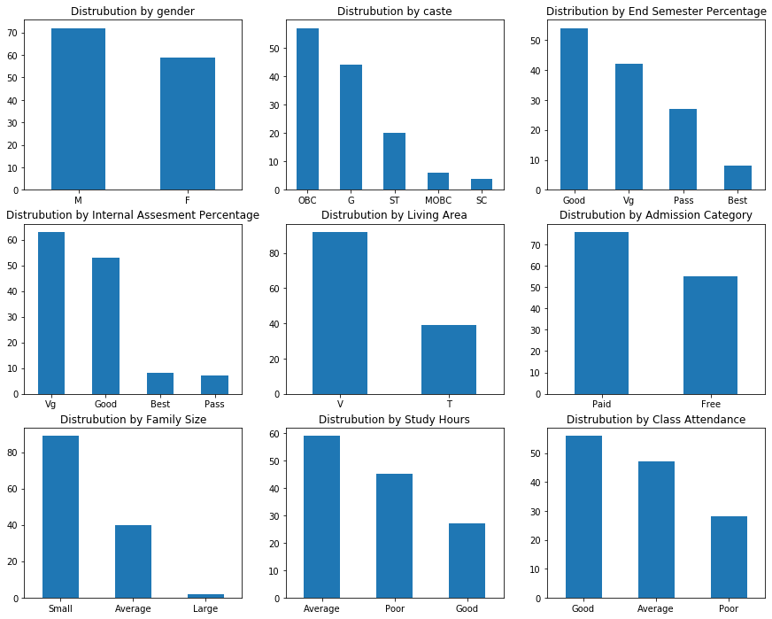
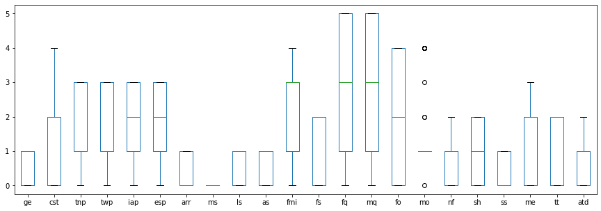
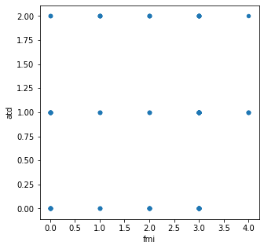
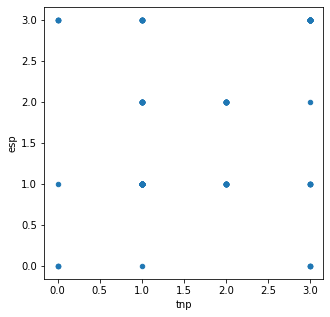
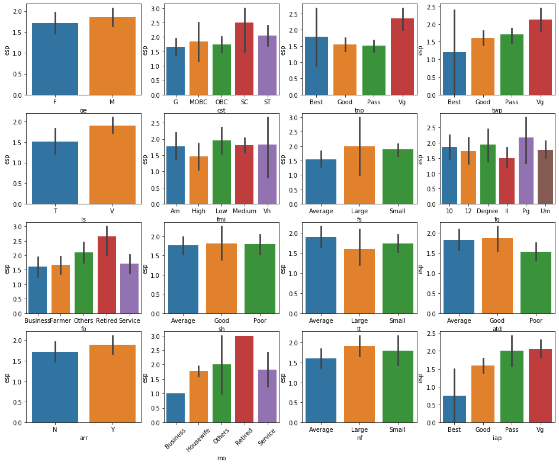
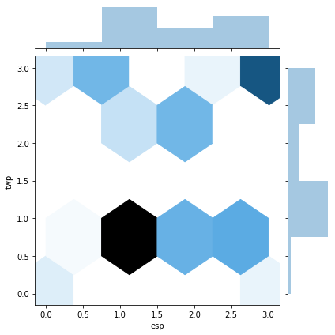
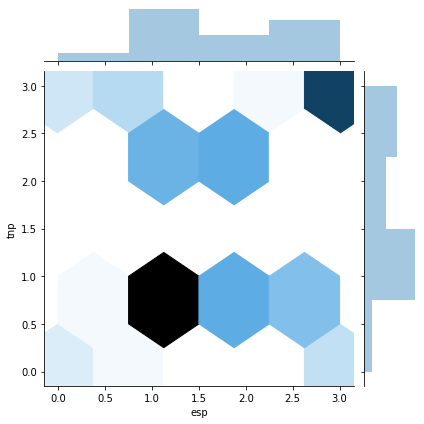
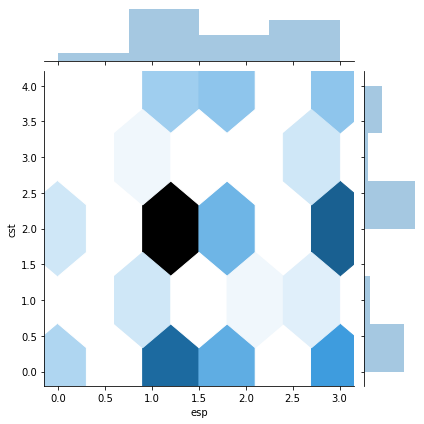
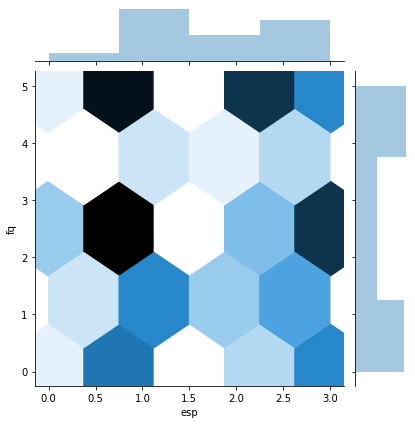
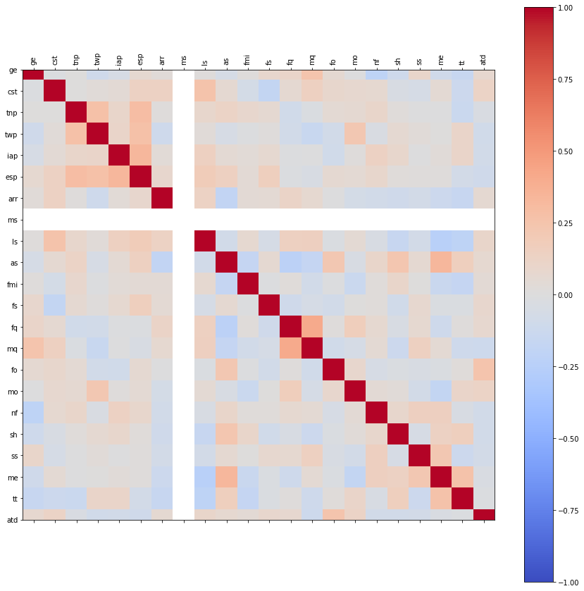

# Student Academic Performance Prediction

**Author:** Sameer Anees Jaliawala  
**Institution:** Habib University  
**Program:** CS457 - Data Science  
**Completion Date:** 2020

---

## Source Code
- [Data Science Project](https://github.com/sameeranees/DataScience-Project)

---

## Project Overview

This data science project presents a comprehensive analysis of student academic performance using machine learning techniques to predict educational outcomes. The research addresses the complex challenge of identifying factors that influence student success by analyzing demographic, socioeconomic, and educational variables through multiple classification algorithms.

The study employs a systematic approach to educational data analysis, implementing five different machine learning algorithms to determine the most effective method for predicting student performance. The project demonstrates the practical application of data science techniques to educational research, providing insights into the factors that may influence academic success.

## Research Objectives

### Primary Objective
The primary objective of this research is to develop and evaluate machine learning models capable of predicting student academic performance based on various demographic, socioeconomic, and educational factors. The study aims to identify the most effective classification algorithm for educational prediction tasks.

### Research Questions
This project addresses the following key research questions:

1. Which machine learning algorithms demonstrate the highest performance for student academic performance prediction?
2. What demographic and socioeconomic factors are most predictive of student academic outcomes?
3. How do different classification approaches compare in terms of accuracy and reliability for educational data?
4. What insights can be gained from analyzing the relationship between student characteristics and academic performance?

## Dataset and Methodology

### Dataset Characteristics
The analysis utilizes a comprehensive dataset containing 131 student records with 22 categorical features representing various aspects of student life and academic environment:

**Demographic Information:**
- Gender, caste, marital status, living situation
- Family size and accommodation type

**Academic Performance:**
- Test scores across multiple subjects (TNP, TWP, IAP, ESP)
- Attendance patterns and academic performance levels

**Family Background:**
- Parental education levels and occupations
- Family income and financial status
- Family size and socioeconomic indicators

**Educational Environment:**
- School type (government vs. private)
- Medium of education and teaching quality
- Class size and learning environment factors

### Data Preprocessing
The preprocessing pipeline involved several critical steps to prepare the data for machine learning analysis:

**Data Decoding:** The dataset required UTF-8 decoding to convert encoded categorical data into readable format, ensuring proper handling of special characters and text encoding issues.

**Data Quality Assessment:** Comprehensive analysis revealed no missing values, duplicates, or null entries, indicating a clean dataset suitable for machine learning applications.

**Feature Engineering:** All variables were categorical in nature, requiring appropriate encoding and preparation for classification algorithms.

### Data Visualization and Analysis
The project included comprehensive data visualization to understand the distribution and relationships within the dataset:

  
*Distribution analysis showing gender, caste, academic performance, and demographic characteristics*

  
*Box plot visualization of encoded categorical variables showing data distribution patterns*

  
*Scatter plot analysis examining relationships between family income and attendance patterns*

  
*Scatter plot showing correlation between test performance and end-semester results*

## Machine Learning Implementation

### Algorithm Comparison
The project implements and evaluates five different classification algorithms to determine the most effective approach for student performance prediction:

#### 1. Logistic Regression
Logistic regression serves as the baseline algorithm for binary classification tasks. The model provides interpretable results and establishes a performance benchmark for comparison with more complex algorithms.

#### 2. Random Forest Classifier
The Random Forest algorithm employs ensemble learning with multiple decision trees to improve prediction accuracy. The implementation includes hyperparameter optimization through random state testing to identify optimal model configurations.

#### 3. Naive Bayes Classifier
The Naive Bayes approach assumes feature independence and provides probabilistic classification. This algorithm demonstrates particular effectiveness with categorical data and offers computational efficiency advantages.

#### 4. Neural Network (MLP)
A Multi-Layer Perceptron neural network provides non-linear modeling capabilities for complex pattern recognition. The implementation utilizes scikit-learn's MLPClassifier with default parameters for baseline performance assessment.

#### 5. Decision Tree Classifier
Decision trees offer interpretable classification with clear decision boundaries. The implementation includes random state optimization to identify the most effective tree configuration for the dataset.

### Model Evaluation Framework
The evaluation methodology employs a systematic approach to ensure reliable performance assessment:

**Train-Test Split:** An 80-20 split provides sufficient training data while maintaining adequate test samples for validation.

**Cross-Validation:** Multiple random states are tested for algorithms that include randomization, ensuring robust performance evaluation.

**Performance Metrics:** Accuracy scores provide direct comparison across different algorithms, enabling identification of the most effective approach.

### Correlation Analysis and Feature Selection
The project included comprehensive correlation analysis to identify the most predictive features:

  
*Comprehensive correlation heatmap showing relationships between all variables in the dataset*

  
*Joint plot analysis examining the relationship between end-semester performance and test scores*

  
*Detailed correlation analysis between academic performance and demographic factors*

  
*Bar plot analysis showing the relationship between various factors and end-semester performance*

## Results and Analysis

### Algorithm Performance Comparison
The comprehensive evaluation reveals significant performance variations across different machine learning approaches:

- **Naive Bayes Classifier:** 59.1% accuracy (Best Performance)
- **Random Forest:** 56.8% accuracy
- **Decision Tree:** 56.8% accuracy
- **Logistic Regression:** 52.3% accuracy
- **Neural Network:** 52.3% accuracy

### Key Findings
The analysis provides several important insights into educational prediction modeling:

**Algorithm Effectiveness:** The Naive Bayes classifier demonstrates superior performance, likely due to its effectiveness with categorical data and the assumption of feature independence that aligns well with the dataset characteristics.

**Performance Limitations:** The moderate accuracy scores across all algorithms highlight the complexity of predicting academic performance from available features, suggesting that additional variables or more sophisticated feature engineering may be necessary for improved predictions.

**Dataset Constraints:** The limited dataset size (131 records) may impact model generalization and performance compared to larger educational datasets, indicating the importance of sample size in educational prediction research.

### Additional Analysis Visualizations
The project included several additional visualizations to provide comprehensive insights:

  
*Advanced correlation analysis showing detailed relationships between academic performance indicators*

  
*Performance distribution analysis examining the spread of academic outcomes across different demographic groups*

  
*Comprehensive analysis summary showing key findings and relationships in the dataset*

## Technical Implementation

### Development Environment
The project utilizes Python 3.6 with a comprehensive suite of data science libraries:

**Core Libraries:**
- **Pandas:** Data manipulation and analysis
- **NumPy:** Numerical computing and array operations
- **SciPy:** Statistical functions and ARFF file handling

**Machine Learning Framework:**
- **Scikit-learn:** Comprehensive machine learning algorithms and evaluation tools
- **Model Selection:** Train-test splitting and cross-validation utilities
- **Classification Algorithms:** Implementation of all five tested approaches

### Code Architecture
The implementation follows a structured approach to data science project development:

**Data Loading:** SciPy's ARFF loader handles the specific dataset format from the UCI Machine Learning Repository.

**Preprocessing Pipeline:** Systematic data cleaning and preparation ensures consistent input for all machine learning algorithms.

**Model Training:** Standardized training procedures enable fair comparison across different algorithms.

**Evaluation Framework:** Consistent evaluation metrics provide reliable performance comparison.

## Research Significance

### Educational Applications
This research contributes to the field of educational data mining by demonstrating the practical application of machine learning techniques to student performance prediction. The findings provide valuable insights for educators and administrators seeking to identify at-risk students and implement targeted interventions.

### Methodological Contributions
The systematic comparison of multiple classification algorithms provides empirical evidence for algorithm selection in educational prediction tasks, particularly for datasets with categorical features and limited sample sizes.

### Technical Insights
The project demonstrates the importance of algorithm selection based on data characteristics, with Naive Bayes showing particular effectiveness for categorical educational data compared to more complex approaches.

## Project Outcomes

The research successfully demonstrates the application of machine learning techniques to educational data analysis, providing a foundation for future work in student performance prediction. The systematic approach to algorithm comparison offers valuable insights for researchers working with similar educational datasets.

The moderate accuracy scores achieved across all algorithms highlight both the potential and limitations of current approaches to educational prediction, suggesting opportunities for future research in feature engineering, larger datasets, and advanced modeling techniques.

## Future Research Directions

### Dataset Expansion
Incorporating larger datasets with more student records would improve model generalization and provide more robust performance evaluation across different educational contexts.

### Feature Engineering
Developing additional derived features from existing data could enhance prediction accuracy by capturing more complex relationships between student characteristics and academic outcomes.

### Advanced Algorithms
Exploring ensemble methods, deep learning approaches, and specialized educational prediction algorithms could provide improved performance for complex educational datasets.

### Domain-Specific Applications
Applying the developed models to specific educational contexts, such as early intervention programs or personalized learning systems, could demonstrate practical value in real-world educational settings.

---
