# Master Thesis: Autonomous Navigation of Multi-Robot Systems in Dynamic Warehousing and Rescue Environments

**Author:** Sameer Anees Jaliawala  
**Institution:** TU Dortmund & Fraunhofer IML  
**Program:** MSc Automation and Robotics   
**Completion Date:** October 2024

---
## Source Code
 - [ISAAC SIM](https://github.com/sameeranees/RL_Multi_Robot)
 - [Gazebo](https://github.com/sameeranees/DRL_robot_navigation_ros2)

---
## Thesis Report  
If you would like a look at the detailed report just send me an email: [sameeraneesj@gmail.com](mailto:sameeraneesj@gmail.com) 

---
## Abstract

This thesis addresses the challenge of autonomous navigation for multi-robot systems in dynamic environments, specifically focusing on intralogistics and disaster management scenarios. The research presents a comprehensive comparison of reinforcement learning algorithms across multiple simulation platforms to determine the most effective approaches for real-world deployment.

The study implements and evaluates three reinforcement learning algorithms (DQN, DDPG, and TD3) across two distinct simulation environments: ISAAC Sim and Gazebo. The experimental results reveal significant performance variations between platforms, with DQN demonstrating superior performance in ISAAC Sim environments while DDPG excels in Gazebo simulations. For multi-robot scenarios, TD3 shows particular promise in ISAAC Sim, achieving notable success rates in complex navigation tasks.

The research contributes to the field by providing empirical evidence of platform-specific algorithm performance and establishing benchmarks for future multi-robot navigation systems.

---

## Research Objectives

### Primary Objective
The primary objective of this research is to evaluate and compare different reinforcement learning algorithms for autonomous robot navigation in dynamic environments, with particular emphasis on intralogistics and disaster management applications. The study aims to determine the most effective algorithmic approaches through comprehensive testing across multiple simulation platforms.

### Research Questions
This thesis addresses the following key research questions:

1. Which reinforcement learning algorithms demonstrate the highest performance for intralogistics and rescue scenario applications?
2. What system architecture and environmental configurations are necessary for effective robot navigation in simulated environments?
3. How do reinforcement learning algorithms perform across different simulation platforms, and what factors contribute to performance variations?
4. How do algorithmic modifications and hyperparameter adjustments affect benchmark performance metrics?
5. How can single-robot navigation algorithms be effectively extended to multi-robot scenarios?
6. What are the current limitations of implemented algorithms and what directions should future research pursue?

These research questions are designed to provide practical insights for the deployment of autonomous navigation systems in real-world applications, particularly in warehouse automation and emergency response scenarios.

---

## Methodology

### Simulation Environments

#### ISAAC Sim Configuration
The ISAAC Sim environment was modeled after a section of the Materials Handling and Warehousing (FLW) hall at TU Dortmund University. This environment features six strategically positioned obstacle walls distributed across the upper and lower sections, creating a complex navigation scenario that closely resembles real-world warehouse conditions.

The robot configuration employs a differential drive system equipped with a Velodyne LiDAR scanner, mirroring the sensor setup commonly found in commercial warehouse robots. ISAAC Sim's primary advantage lies in its exceptional physics simulation accuracy, which provides superior sim-to-real transferability compared to other simulation platforms. This characteristic makes it particularly valuable for testing algorithms intended for real-world deployment.

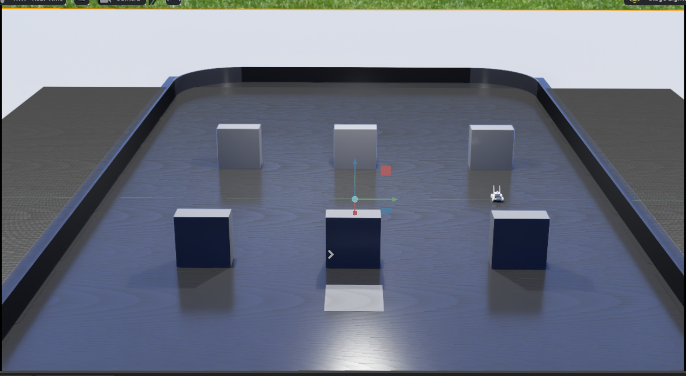  
*ISAAC Sim Environment for Single Robot Navigation*

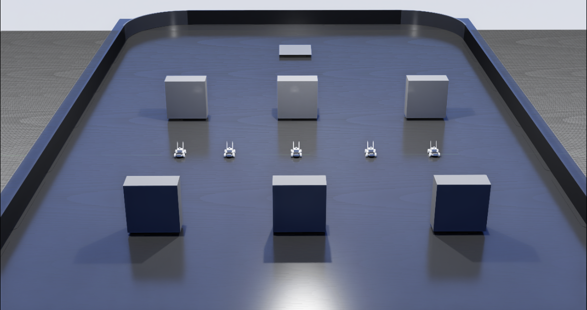  
*ISAAC Sim Environment for Multi Robot Navigation*

#### Gazebo Configuration
A complementary environment was developed in Gazebo with a similar layout but reduced scale to enable direct performance comparison with ISAAC Sim. The primary objective was to evaluate algorithm consistency across different simulation platforms and identify platform-specific performance characteristics.

The robot configuration was maintained identically across both platforms, ensuring fair comparison conditions. This approach revealed significant performance variations between simulation environments, highlighting the importance of multi-platform validation for algorithm robustness assessment.

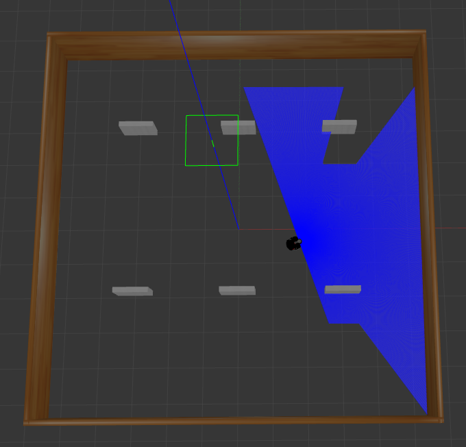  
*Gazebo Environment for Single Robot Navigation*

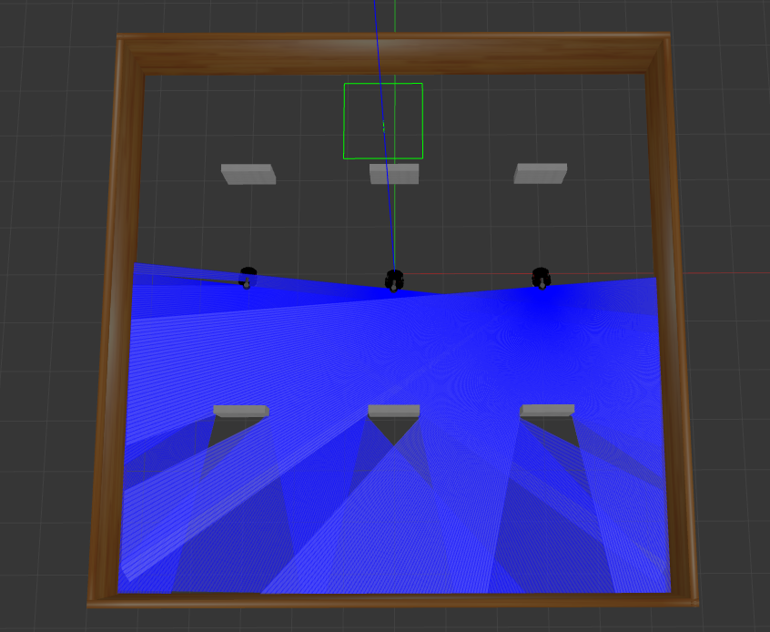  
*Gazebo Environment for Multi Robot Navigation*

### Implemented Algorithms

#### 1. Deep Q-Network (DQN)
The Deep Q-Network serves as the baseline algorithm for this research, representing one of the most established approaches in deep reinforcement learning. The algorithm processes environmental information through a 54-dimensional input vector comprising heading to goal (HTG), distance to goal (DTG), and 52 laser scan distance measurements.

The network architecture follows a [54, 300, 300, 3] configuration, featuring two hidden layers of 300 neurons each and three discrete action outputs (forward, turn left, turn right). The implementation incorporates a large replay buffer for experience storage and epsilon-greedy exploration strategy to balance exploration and exploitation during the learning process.

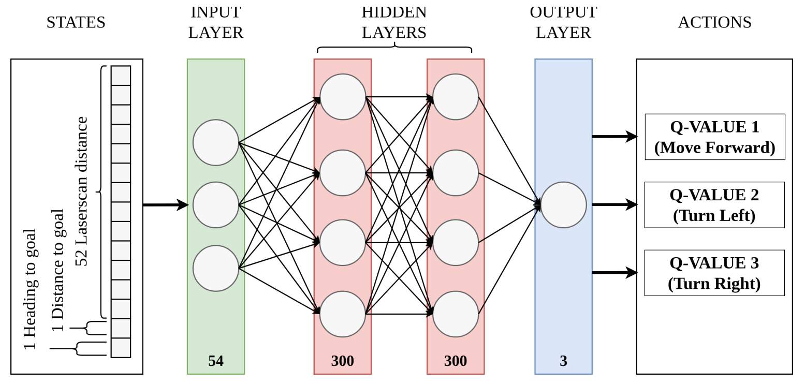  
*Deep Q-Network Architecture*

#### 2. Deep Deterministic Policy Gradient (DDPG)
The Deep Deterministic Policy Gradient algorithm represents an advancement in continuous control for robotic navigation. Unlike DQN's discrete action space, DDPG outputs continuous angular and linear velocities, enabling smoother and more natural robot movement patterns.

The input representation employs a more sophisticated approach, utilizing 10-dimensional sparse laser scan findings along with the robot's previous actions and relative target position. The network architecture implements an Actor-Critic framework with three dense layers of 512 neurons each, where the Actor network determines optimal actions while the Critic network evaluates action quality. The implementation incorporates target network updates and experience replay mechanisms to enhance learning stability.

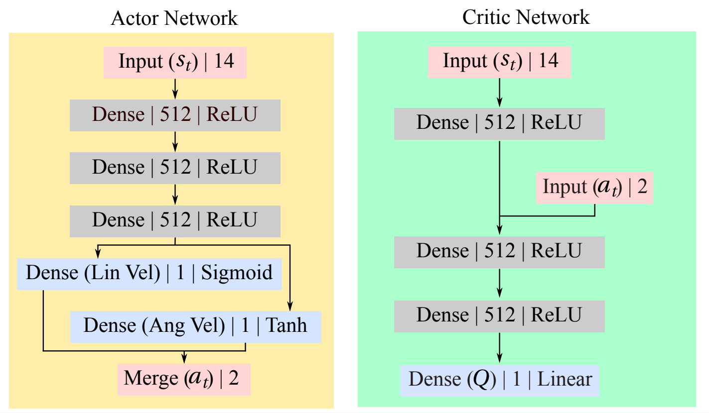  
*Deep Deterministic Policy Gradient Architecture*

#### 3. Twin Delayed DDPG (TD3)
The Twin Delayed DDPG algorithm represents the most sophisticated approach implemented in this research, specifically designed to address the complexities inherent in multi-robot navigation scenarios. The algorithm processes 20-dimensional Points of Interest (POIs) extracted from laser scan data, combined with robot action history and relative distance and heading to goal information.

The network architecture features an Actor network with 800×600 neurons and two separate Critic networks following an 800→600→600 configuration. The "Twin" component employs dual critics to mitigate overestimation bias, while the "Delayed" mechanism updates the policy less frequently than the critics, enhancing stability in complex multi-agent environments where multiple robots must navigate shared spaces simultaneously.

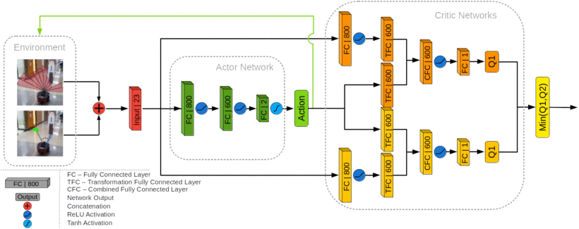  
*Twin Delayed DDPG Architecture*

### System Architecture

#### Robot Sensor Configuration
- **LiDAR:** Velodyne rotating scanner providing 360° range data
- **Odometry:** Position and orientation tracking
- **Point Cloud:** 3D environment mapping capabilities

#### Action Graph Components
- ROS2 Twist Subscriber for velocity commands
- Differential Controller for wheel velocity calculation
- Articulation Controller for motor control

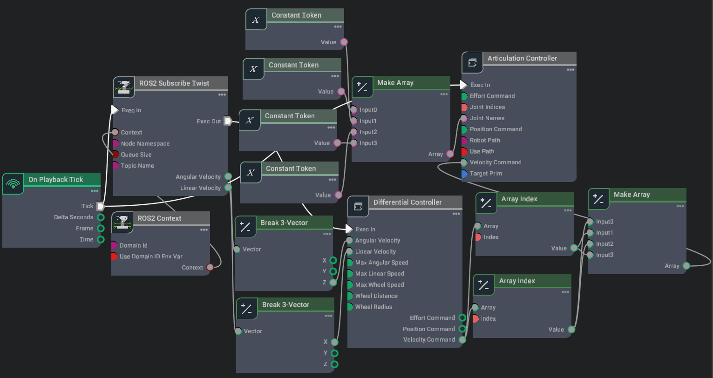  
*Robot Action Graph Architecture*

#### Sensor Graph Components
- Isaac Create Render Product for LiDAR rendering
- Isaac Read Lidar Beam Node for sensor data processing
- ROS2 Publish Laser Scan for communication
- Isaac Compute Odometry Node for position tracking

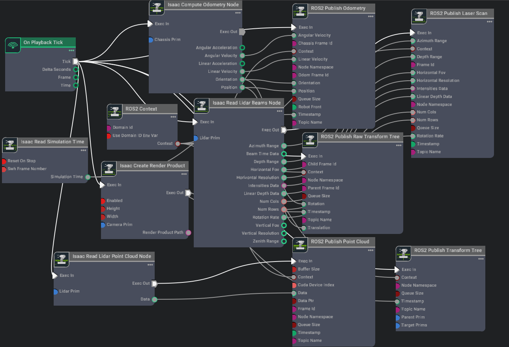  
*Robot Sensor Graph Architecture*

---

## Experimental Results

### Single-Robot Navigation Performance

#### ISAAC Sim Results
<table>
  <thead>
    <tr>
      <th>Algorithm</th>
      <th>Original</th>
      <th>1st Param</th>
      <th>2nd Param</th>
      <th>3rd Param</th>
    </tr>
  </thead>
  <tbody>
    <tr>
      <td><strong>DQN</strong></td>
      <td>1.6%</td>
      <td>1.3%</td>
      <td>3.9%</td>
      <td>3.2%</td>
    </tr>
    <tr>
      <td><strong>DDPG</strong></td>
      <td>0%</td>
      <td>0.2%</td>
      <td>0%</td>
      <td>0%</td>
    </tr>
    <tr>
      <td><strong>TD3</strong></td>
      <td>0.4%</td>
      <td>0%</td>
      <td>0%</td>
      <td>0%</td>
    </tr>
  </tbody>
</table>

*Success rates across different parameterizations*

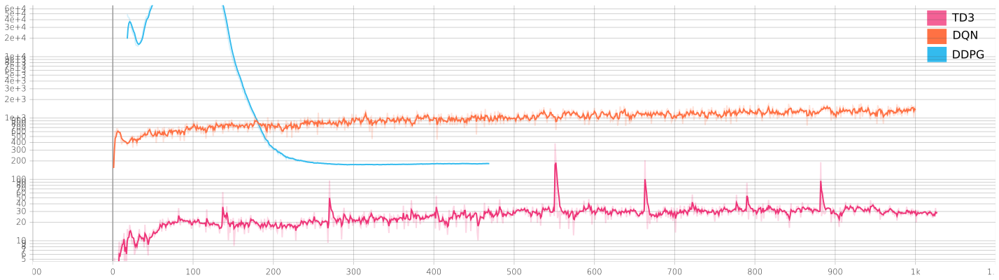  
*Training Loss Comparison - Original Implementation*

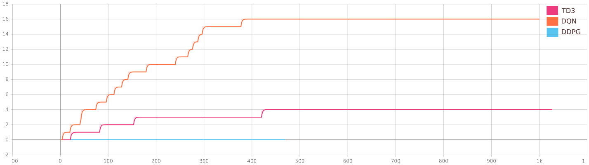  
*Success Rate Comparison - Original Implementation*

#### Gazebo Results
<table>
  <thead>
    <tr>
      <th>Algorithm</th>
      <th>Randomized Goals</th>
      <th>Fixed Goals</th>
    </tr>
  </thead>
  <tbody>
    <tr>
      <td><strong>DQN</strong></td>
      <td>18%</td>
      <td>1.2%</td>
    </tr>
    <tr>
      <td><strong>DDPG</strong></td>
      <td>19.5%</td>
      <td>45.8% (78.4% after convergence)</td>
    </tr>
    <tr>
      <td><strong>TD3</strong></td>
      <td>4.6%</td>
      <td>2.72%</td>
    </tr>
  </tbody>
</table>

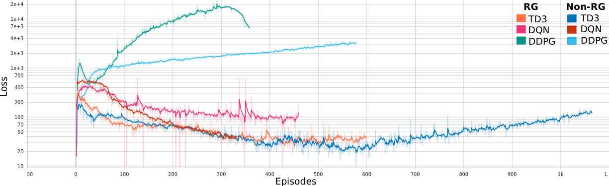  
*Training Loss Comparison in Gazebo Environment*

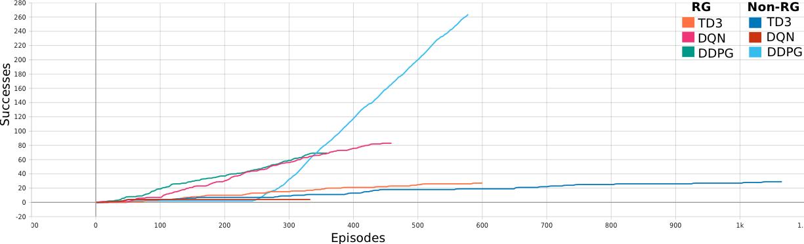  
*Success Rate Comparison in Gazebo Environment*

### Multi-Robot Navigation Performance

#### ISAAC Sim Multi-Robot Results
<table>
  <thead>
    <tr>
      <th>Algorithm</th>
      <th>Success Rate</th>
    </tr>
  </thead>
  <tbody>
    <tr>
      <td><strong>Multi TD3</strong></td>
      <td>0.14%</td>
    </tr>
    <tr>
      <td><strong>Multi DQN</strong></td>
      <td>0%</td>
    </tr>
  </tbody>
</table>

#### Gazebo Multi-Robot Results
<table>
  <thead>
    <tr>
      <th>Algorithm</th>
      <th>Success Rate</th>
    </tr>
  </thead>
  <tbody>
    <tr>
      <td><strong>Multi TD3</strong></td>
      <td>0%</td>
    </tr>
    <tr>
      <td><strong>Multi DDPG</strong></td>
      <td>0%</td>
    </tr>
  </tbody>
</table>

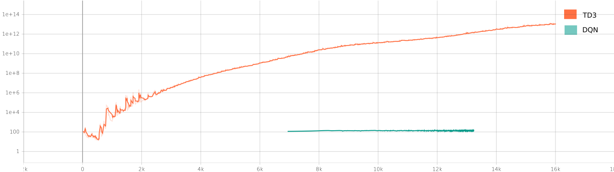  
*Multi-Robot Training Loss in ISAAC Sim*

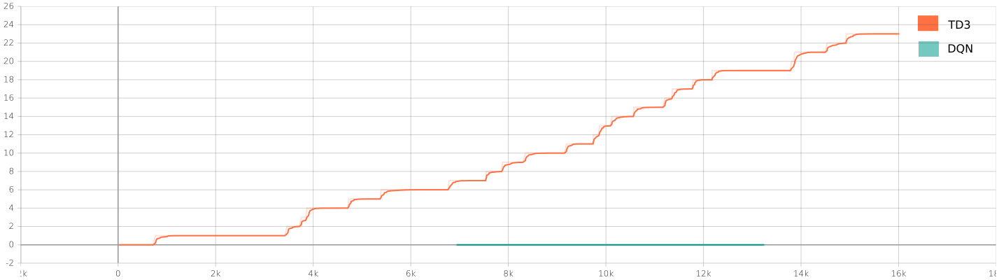  
*Multi-Robot Success Rate in ISAAC Sim*

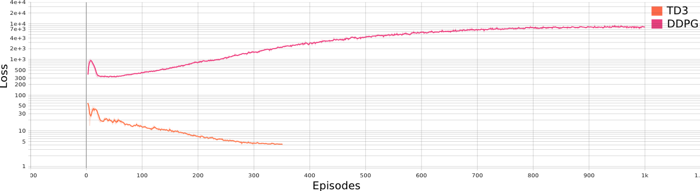  
*Multi-Robot Training Loss in Gazebo*

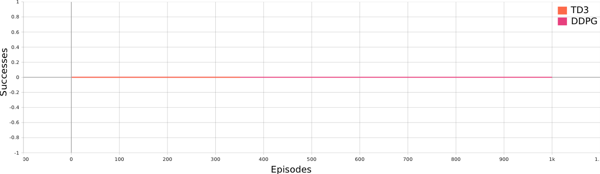  
*Multi-Robot Success Rate in Gazebo*

### Key Performance Insights

#### Algorithm-Specific Findings
- **DQN:** Most consistent performance in ISAAC Sim, highest success rates across parameterizations
- **DDPG:** Excellent performance in Gazebo with fixed goals (78.4% success rate after convergence)
- **TD3:** Best performance in multi-robot scenarios within ISAAC Sim

#### Environment-Specific Observations
- **ISAAC Sim:** More challenging environment, lower overall success rates
- **Gazebo:** Better algorithm performance, particularly for DDPG with fixed goals
- **Multi-Robot:** Significant performance degradation compared to single-robot scenarios

### Advanced Parameterization Results

#### Gradient Clipping Implementation
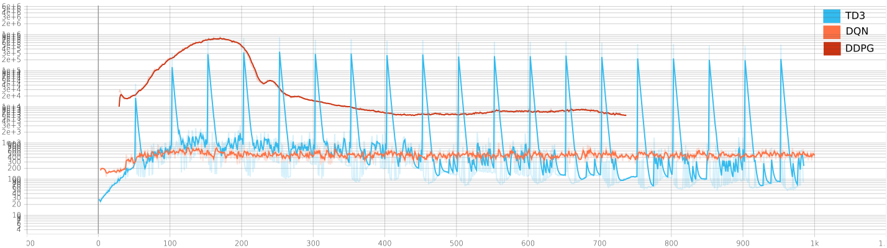  
*Training Loss with Gradient Clipping Implementation*

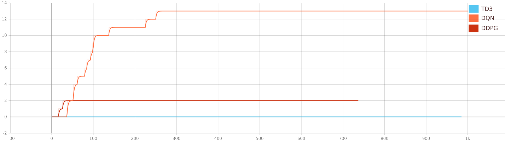  
*Success Rate with Gradient Clipping Implementation*

#### Delayed Training, Prioritized Memory, and Randomized Robots
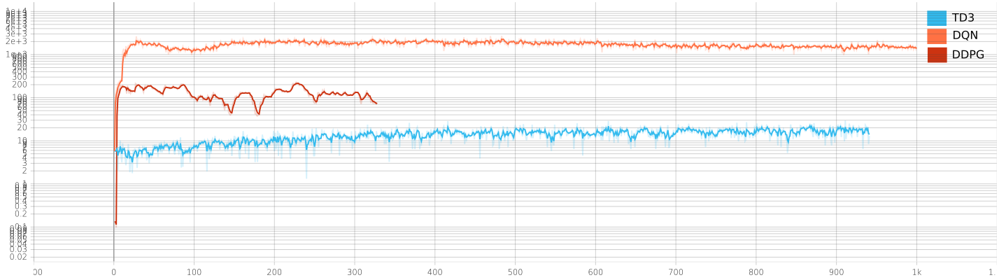  
*Training Loss with Delayed Training, Prioritized Memory, and Randomized Robots*

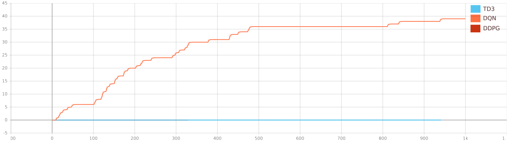  
*Success Rate with Delayed Training, Prioritized Memory, and Randomized Robots*

---

## Technical Implementation Details

### Reward Structures

#### Single-Robot Rewards
<table>
  <thead>
    <tr>
      <th>Case</th>
      <th>DQN</th>
      <th>DDPG</th>
      <th>TD3</th>
    </tr>
  </thead>
  <tbody>
    <tr>
      <td>Target Reached</td>
      <td>+200-500</td>
      <td>+120</td>
      <td>+100</td>
    </tr>
    <tr>
      <td>Collision</td>
      <td>-200</td>
      <td>-100</td>
      <td>-100</td>
    </tr>
    <tr>
      <td>Linear Step</td>
      <td>+5/-5</td>
      <td>-5</td>
      <td>-5</td>
    </tr>
    <tr>
      <td>Angular Step</td>
      <td>+1/-1</td>
      <td>-1</td>
      <td>-1</td>
    </tr>
    <tr>
      <td>DTG Improvement</td>
      <td>+5</td>
      <td>Variable</td>
      <td>-</td>
    </tr>
    <tr>
      <td>HTG Improvement</td>
      <td>+1</td>
      <td>-</td>
      <td>-</td>
    </tr>
  </tbody>
</table>

#### Multi-Robot Rewards
<table>
  <thead>
    <tr>
      <th>Case</th>
      <th>Multi TD3</th>
      <th>Multi DQN</th>
    </tr>
  </thead>
  <tbody>
    <tr>
      <td>Target Reached</td>
      <td>+200</td>
      <td>+500</td>
    </tr>
    <tr>
      <td>Collision</td>
      <td>-200</td>
      <td>-100</td>
    </tr>
    <tr>
      <td>Linear Step</td>
      <td>-2</td>
      <td>-5</td>
    </tr>
    <tr>
      <td>Angular Step</td>
      <td>-2</td>
      <td>-1</td>
    </tr>
    <tr>
      <td>DTG Improvement</td>
      <td>+1</td>
      <td>+5</td>
    </tr>
    <tr>
      <td>HTG Improvement</td>
      <td>+1</td>
      <td>+1</td>
    </tr>
  </tbody>
</table>

### Key Parameters
- **Learning Rate:** 0.0001-0.001
- **Discount Factor:** 0.95-0.99999
- **Memory Size:** 100,000-1,000,000
- **Batch Size:** 40-128
- **Exploration Rate:** 0.01-1.0

---

## Navigation Stack Integration

### System Architecture
The research successfully integrated the DRL local planner with a global planner to form a complete navigation stack:

1. **Global Planner:** Utilizes global costmap from map server
2. **Local Planner:** DRL-based obstacle avoidance and path following
3. **Controller:** Converts paths to velocity commands
4. **Simulation Environment:** Provides sensor data and executes commands

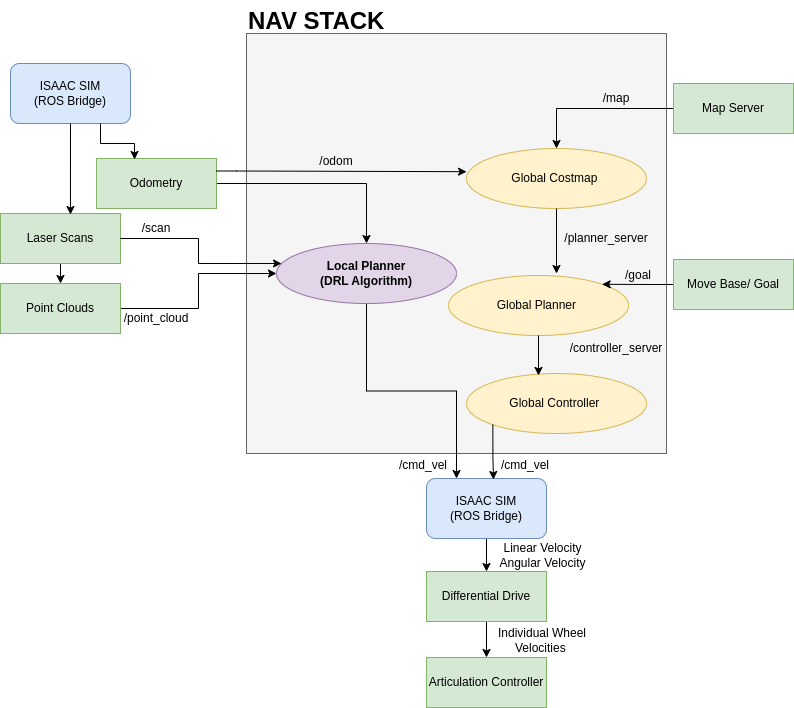  
*Navigation Stack Architecture*

### Integration Results
- Successful overlap between laser scan data and predefined maps
- Real-time navigation capability within mapped environments
- Effective coordination between global and local planning modules

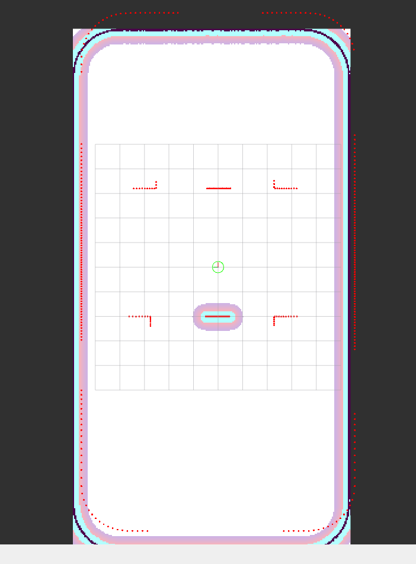  
*Navigation Stack Integration in RViz*

---

## Key Findings and Contributions

### Major Achievements
1. **Algorithm Comparison:** Comprehensive evaluation of DQN, DDPG, and TD3 across multiple environments
2. **Environment Analysis:** Detailed comparison between ISAAC Sim and Gazebo simulation platforms
3. **Multi-Robot Extension:** Successful extension of single-robot algorithms to multi-robot scenarios
4. **Navigation Stack:** Complete integration of DRL local planner with traditional navigation stack

### Performance Insights
- **DQN** demonstrates superior performance in ISAAC Sim environments
- **DDPG** achieves excellent results in Gazebo with fixed goals (78.4% success rate)
- **TD3** shows promise for multi-robot coordination in ISAAC Sim
- Environment-specific optimization is crucial for algorithm performance

### Technical Contributions
- Implementation of multiple parameterization strategies
- Integration of gradient clipping and prioritized memory
- Development of delayed training mechanisms
- Creation of comprehensive reward structures

---

## Limitations and Challenges

### Algorithm Limitations
- **Overfitting:** Algorithms showed signs of overfitting in certain environments
- **Environment Dependency:** Performance varied significantly between simulation platforms
- **Multi-Robot Challenges:** Significant performance degradation in multi-robot scenarios
- **Training Instability:** Algorithms crashed after extended training periods

### Technical Challenges
- **Physics Engine Differences:** Variations between ISAAC Sim and Gazebo physics
- **Sensor Configuration:** LiDAR sensor limitations affecting input quality
- **Computational Resources:** High computational requirements for multi-robot training
- **Sim-to-Real Transfer:** Challenges in transferring simulation results to real-world applications

---

## Future Directions

### Recommended Approaches
1. **PPO Algorithm:** Potential for better performance with parallelized simulation environments
2. **ISAAC Gym:** Leverage GPU acceleration for faster training and improved results
3. **Hybrid Methods:** Combine classical and machine learning approaches for robust navigation
4. **Extended Training:** Longer training periods with improved stability mechanisms

### Research Opportunities
- **Real-World Deployment:** Testing algorithms on physical robots
- **Advanced Multi-Robot Coordination:** Improved communication and coordination strategies
- **Dynamic Environment Adaptation:** Algorithms that adapt to changing environments
- **Semantic Navigation:** Integration of semantic understanding for complex scenarios

---

## Conclusion

This research successfully demonstrates the implementation and comparison of reinforcement learning algorithms for autonomous robot navigation in dynamic environments. The findings provide valuable insights into algorithm performance across different simulation platforms and highlight the challenges and opportunities in multi-robot navigation systems.

The work contributes to the growing field of autonomous robotics by providing a comprehensive framework for evaluating navigation algorithms and establishing a foundation for future research in intralogistics and disaster management applications.

### Key Takeaways
- **Environment-Specific Optimization:** Different algorithms excel in different simulation environments
- **Multi-Robot Complexity:** Significant challenges remain in scaling single-robot solutions to multi-robot systems
- **Integration Success:** DRL algorithms can be successfully integrated with traditional navigation stacks
- **Future Potential:** Continued research in PPO and parallelized training shows promise for improved performance

---