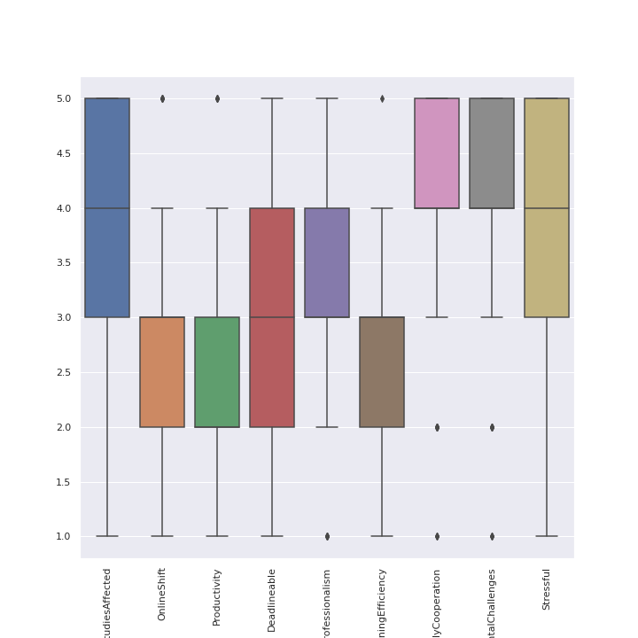
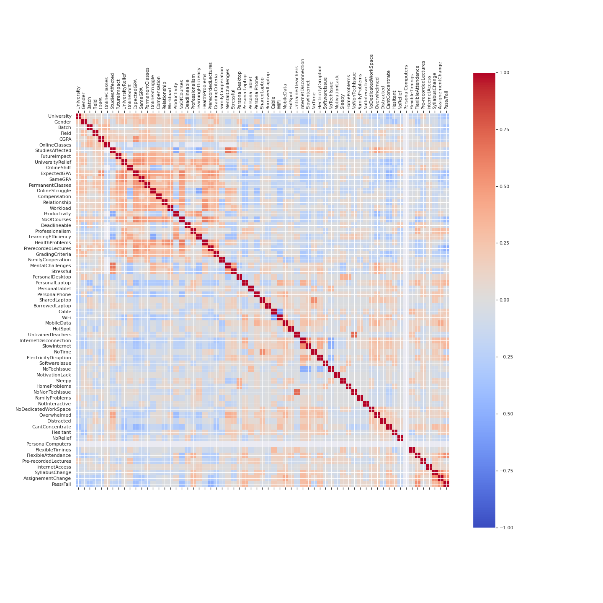
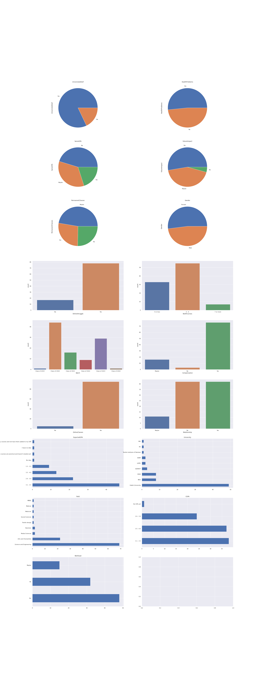
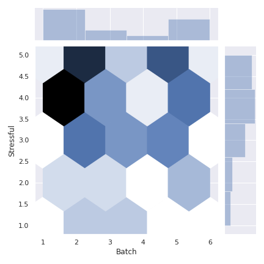
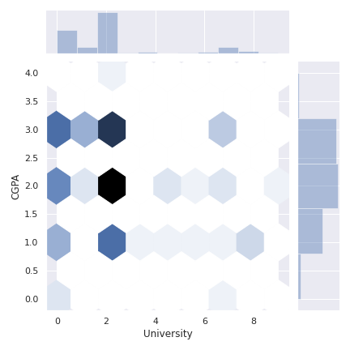

# University Students Pandemic Analysis

**Author:** Sameer Anees Jaliawala  
**Institution:** Habib University  
**Program:** Microbes Final Project  
**Completion Date:** 2019

---

## Source Code
- [Microbes Project Repository](https://github.com/sameeranees/Microbes-Project)

---

## Project Overview

This project analyzes self-collected data from university students during the COVID-19 pandemic to understand the comprehensive impact on student life, academic performance, and mental health. The study provides valuable insights into how university students adapted to the unprecedented challenges posed by the global health crisis and offers evidence-based recommendations for educational institutions.

The research addresses the critical need to understand the pandemic's effects on higher education, where traditional learning environments were disrupted and students faced significant challenges in adapting to new educational modalities, social isolation, and uncertainty about their academic and career futures.

## Dataset and Research Scope

### Survey Design and Data Collection
Comprehensive data collection from university students during the pandemic:

- **Sample Size:** 103 university students across multiple institutions
- **Variables:** 39 comprehensive survey questions covering multiple life domains
- **Demographics:** Gender, university affiliation, academic level, and background information
- **Pandemic Impact:** Academic, social, health, and psychological factors
- **Data Quality:** Self-reported responses with validation and cleaning procedures

### Research Domains
Multi-faceted analysis covering critical aspects of student life:

**Academic Impact:** Learning adaptation, performance changes, technology usage, and study environment modifications during the transition to online education.

**Mental Health and Well-being:** Stress levels, anxiety, social isolation effects, coping strategies, and support system effectiveness during pandemic challenges.

**Lifestyle Modifications:** Daily routine changes, social interaction patterns, health behaviors, and future planning adjustments in response to pandemic restrictions.

## Methodology and Analysis

### Data Collection Framework
Systematic approach to gathering comprehensive student experiences:

**Survey Design:** Multi-domain questionnaire covering academic, social, psychological, and health-related aspects of student life during the pandemic.

**Sampling Strategy:** University student population across different institutions to ensure representative coverage of diverse experiences and backgrounds.

**Data Validation:** Quality assessment and cleaning procedures to ensure data integrity and reliability of self-reported responses.

**Ethical Considerations:** Anonymous participation, informed consent, and protection of student privacy throughout the research process.

### Statistical Analysis Implementation
Rigorous analytical methods for meaningful insights:

**Descriptive Statistics:** Comprehensive summary of student experiences, characteristics, and pandemic impact across different demographic groups and life domains.

**Correlation Analysis:** Identification of relationships between different pandemic impacts, academic performance, and psychological well-being factors.

**Visualization Techniques:** Advanced charts, graphs, and statistical plots for pattern identification and intuitive understanding of complex data relationships.

**Hypothesis Testing:** Statistical validation of research assumptions and identification of significant patterns in student experiences and adaptation strategies.

## Key Findings and Insights

### Academic Adaptation and Performance

#### Online Learning Experience
Analysis reveals mixed experiences with virtual education platforms:

**Technology Adoption:** Students demonstrated varying levels of comfort and proficiency with digital learning tools, with significant differences based on prior technology experience and institutional support.

**Learning Effectiveness:** Online learning effectiveness varied significantly across subjects, with some disciplines adapting better to virtual formats than others.

**Engagement Challenges:** Reduced face-to-face interaction created challenges for student engagement, participation, and collaborative learning experiences.

**Assessment Adaptation:** Traditional assessment methods required significant modification, with students and faculty adapting to new evaluation approaches and academic integrity measures.

#### Academic Performance Impact
Comprehensive analysis of pandemic effects on academic achievement:

**Grade Variations:** Academic performance showed mixed results, with some students maintaining or improving grades while others experienced significant challenges.

**Study Habit Changes:** Fundamental shifts in study approaches, time management, and learning strategies in response to online education and home learning environments.

**Motivation Factors:** Changes in academic motivation, goal-setting, and future planning due to uncertainty and disrupted educational experiences.

**Support Needs:** Identification of areas where students required additional academic support, resources, and guidance during the transition period.

### Mental Health and Psychological Well-being

#### Stress and Anxiety Analysis
Comprehensive assessment of psychological impact:

**Stress Factors:** Academic pressure, uncertainty about the future, and social isolation emerged as primary stressors affecting student mental health and well-being.

**Anxiety Patterns:** Increased anxiety levels related to academic performance, career planning, and personal safety during the pandemic period.

**Coping Mechanisms:** Various strategies students employed to manage pandemic-related stress, including social support, physical activity, and creative pursuits.

**Resilience Factors:** Personal characteristics and environmental factors that helped students adapt and maintain psychological well-being during challenging circumstances.

#### Social Isolation and Connection
Analysis of social impact and adaptation strategies:

**Social Distancing Effects:** Significant impact of reduced in-person social interaction on student mental health, academic performance, and overall well-being.

**Virtual Socialization:** Creative approaches students developed to maintain social connections through digital platforms and virtual activities.

**Support Systems:** Effectiveness of family, friends, and institutional support in helping students navigate pandemic challenges and maintain social connections.

**Community Building:** New forms of virtual community and peer support that emerged during the pandemic period.

### Lifestyle and Behavioral Changes

#### Daily Routine Modifications
Comprehensive analysis of lifestyle adaptations:

**Schedule Disruption:** Fundamental changes in daily routines, sleep patterns, and time management due to home-based learning and reduced external structure.

**Health Behaviors:** Changes in physical activity, eating habits, and wellness practices in response to pandemic restrictions and lifestyle modifications.

**Hobby Development:** New activities and interests students adopted during lockdown periods, including creative pursuits, skill development, and personal projects.

**Technology Usage:** Increased reliance on digital tools for education, entertainment, and social connection, with varying impacts on well-being and productivity.

#### Future Planning and Career Development
Analysis of long-term impact on student aspirations:

**Career Uncertainty:** Increased anxiety and uncertainty about future career prospects, job market conditions, and professional development opportunities.

**Academic Goals:** Modifications to academic plans, course selections, and degree completion timelines in response to pandemic disruptions.

**Skill Development:** New skills and competencies students developed during the pandemic, including digital literacy, self-directed learning, and adaptability.

**Resilience Building:** Long-term personal growth and resilience development through navigating pandemic challenges and adapting to new circumstances.

## Data Visualization and Analysis

### Statistical Visualizations
Comprehensive visual analysis of survey data:


*Box plot analysis showing distribution of student responses across different pandemic impact categories*


*Correlation matrix showing relationships between different aspects of student life during the pandemic*


*Full analysis visualization showing key findings and patterns in student pandemic experiences*


*Joint plot analysis examining the relationship between academic batch and stress levels during the pandemic*


*Analysis of academic performance patterns across different universities during the pandemic period*


## Research Implications and Applications

### Educational Institutions
Evidence-based recommendations for institutional support:

**Support Services Enhancement:** Development of comprehensive mental health and academic support programs tailored to pandemic-related challenges and student needs.

**Technology Infrastructure:** Investment in improved digital learning platforms, tools, and resources to support effective online education and student engagement.

**Student Services Adaptation:** Modification of support systems to address pandemic-specific challenges and provide accessible resources for student success.

**Policy Development:** Evidence-based policies for crisis management, emergency response, and student support during future disruptions or challenges.

### Student Well-being and Support
Practical applications for student success and mental health:

**Mental Health Resources:** Increased awareness and accessibility of mental health services, counseling, and support resources for students facing pandemic-related challenges.

**Coping Strategy Development:** Sharing effective stress management techniques, resilience-building strategies, and peer support mechanisms.

**Community Building:** Development of stronger student community networks, virtual support groups, and peer mentoring programs.

**Skill Development:** Programs to help students develop adaptive skills, digital literacy, and resilience for future challenges and opportunities.

## Project Structure

```
Microbes-Project/
├── Microbes.ipynb          # Main analysis notebook
├── Microbes.html          # HTML export of analysis
├── MicrobesData.csv       # Survey dataset
├── README.md              # Project documentation
└── Visualizations/        # Generated charts and graphs
    ├── boxplots.png
    ├── CorrelationGraph.png
    ├── full_figure1.png
    └── joinplot_*.png
```

## Future Research Directions

### Longitudinal Studies
Comprehensive follow-up research opportunities:

**Long-term Impact Assessment:** Follow-up studies to understand the lasting effects of pandemic experiences on student academic performance, career development, and personal growth.

**Recovery Pattern Analysis:** Understanding how students adapted and recovered from pandemic challenges, identifying factors that facilitated successful adaptation.

**Resilience Factor Identification:** Research to identify personal and environmental factors that helped students maintain well-being and academic success during challenging circumstances.

### Comparative and Expanded Research
Broader research scope and international perspectives:

**Cross-institutional Analysis:** Comparative studies across different universities and educational systems to understand varying pandemic impacts and response strategies.

**International Studies:** Global perspective on student pandemic experiences, cultural differences in adaptation strategies, and international best practices for student support.

**Demographic Analysis:** Understanding differential impacts across student groups, including first-generation students, international students, and students from underrepresented backgrounds.

## Results and Impact

### Research Contributions
The project provides valuable insights into the student experience during the COVID-19 pandemic, contributing to understanding how educational communities can better support students during crisis situations and prepare for future challenges.

### Practical Applications
The research findings offer actionable recommendations for educational institutions, student support services, and policy makers to improve student experiences and outcomes during challenging circumstances.

---