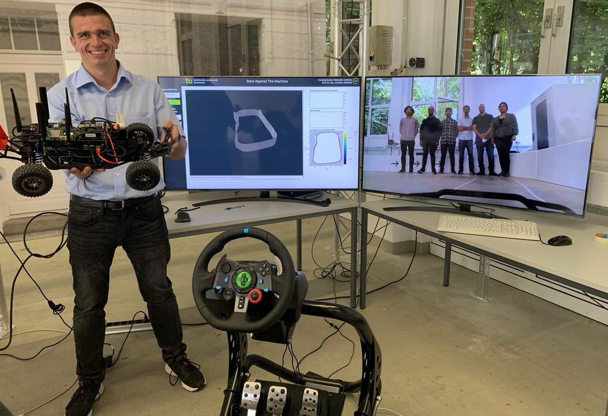
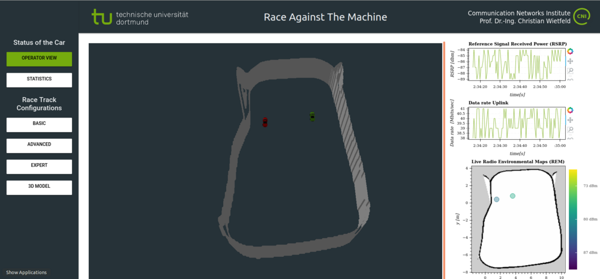
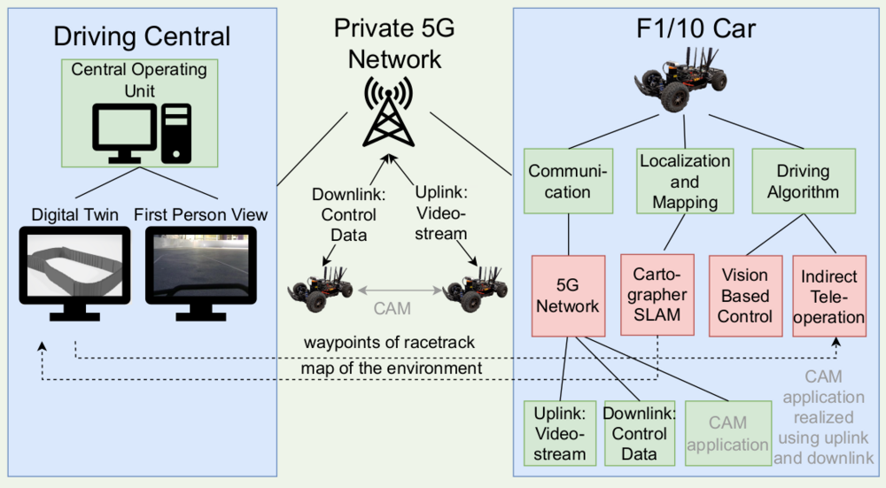
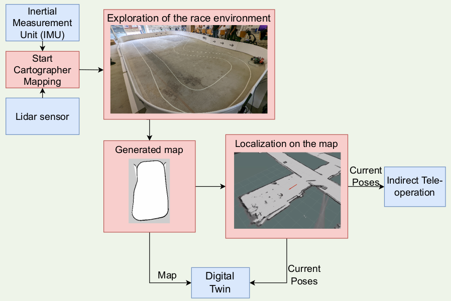

# Race Against the Machine – 5G Enabled Tele-Operated vs Automated Driving

**Duration:** 2021 - 2022  
**Technologies:** ROS, Python, C++, 5G Networks, SLAM, Web Technologies  
**Institution:** TU Dortmund University - Chair of Communication Networks (CNI)  

---
## Source Code

Unfortunately, the code is proprietary and cannot be shared. However for more information about the project, visit the official TU Dortmund University page:
[Race Against the Machine - TU Dortmund CNI](https://cni.etit.tu-dortmund.de/newsdetail/race-against-the-machine-22130/)

---
## Project Overview

The "Race Against the Machine" project was a comprehensive research initiative conducted during the winter semester of 2021/2022 at TU Dortmund University. The project explored the intersection of 5G communication technology and autonomous vehicle systems, focusing on teleoperated driving scenarios using the F1/10 platform. The project investigated the robustness of private 5G networks in teleoperated driving and implemented various approaches for autonomous driving in a controlled laboratory environment.

*Project team working on the F1/10 platform and teleoperation system*

## Technical Approach

### 5G-Enabled Teleoperation
The project leveraged 5G communication technology to achieve high-quality teleoperation with low latency and high resilience. The Quality of Experience (QoE) for teleoperated driving scenarios was evaluated by analyzing both application-specific requirements and the Quality of Service (QoS) provided by the network infrastructure.

### Autonomous Driving Implementation
Multiple autonomous driving approaches were developed and tested:
- **Direct Teleoperation:** Real-time remote control using 5G networks
- **Indirect Teleoperation:** Semi-autonomous systems with human oversight
- **Vision-Based Autonomous Driving:** Fully autonomous navigation using computer vision

### Digital Twin Integration
A sophisticated web-based digital twin was developed with ROS integration to visualize:
- Real-time vehicle locations and states
- Environmental conditions and obstacles
- Network performance metrics
- Track boundaries and navigation paths

*Web-based digital twin interface showing real-time vehicle tracking and environment visualization*

## Key Technical Components

### SLAM Implementation
- **Google Cartographer Integration:** Implemented simultaneous localization and mapping (SLAM) to provide accurate positioning data
- **Real-time Mapping:** Generated 3D models from SLAM results for comprehensive environment visualization
- **Track Generation:** Automated track boundary generation from open map data, scaling real racetracks to laboratory environments

### Web-Based Interface
- **Digital Twin Visualization:** Real-time 3D visualization of vehicles and environment
- **Network Metrics Dashboard:** RESTful API integration for monitoring network performance
- **Interactive Controls:** Web-based interface for teleoperation and system monitoring

### F1/10 Platform Integration
- **Small-Scale Testing:** Utilized F1/10 vehicles for safe and controlled testing environments
- **Multi-Modal Operation:** Support for autonomous, semi-autonomous, and teleoperated modes
- **Sensor Integration:** Comprehensive sensor suite for navigation and obstacle detection

## Research Significance

### Industry Relevance
The project addressed critical challenges in autonomous vehicle development:
- **SAE Level 4 Compliance:** Demonstrated teleoperator intervention capabilities for unknown situations
- **Rescue Robotics Applications:** Validated teleoperation approaches for industrial and emergency scenarios
- **Network Reliability:** Established benchmarks for 5G network performance in critical applications

### Technical Innovation
- **Hybrid Control Systems:** Seamless integration of autonomous and teleoperated driving modes
- **Real-time Digital Twins:** Advanced visualization and monitoring capabilities
- **Network-Aware Navigation:** Integration of network performance metrics into vehicle control systems

## Project Outcomes

The project successfully demonstrated:
- **Robust 5G Teleoperation:** Reliable remote control with minimal latency
- **Autonomous Navigation:** Effective vision-based autonomous driving capabilities
- **Digital Twin Technology:** Comprehensive real-time monitoring and visualization
- **Multi-Modal Integration:** Seamless switching between autonomous and teleoperated modes

## Technical Architecture

The system architecture incorporated:
- **ROS-based Communication:** Distributed system architecture for vehicle control
- **5G Network Integration:** Low-latency communication infrastructure
- **Web Technologies:** Modern web interface for monitoring and control
- **SLAM Processing:** Real-time mapping and localization algorithms

*System architecture diagram showing the integration of 5G networks, ROS communication, and web-based monitoring*

*Process flow diagram illustrating the teleoperation and autonomous driving workflow*

## Impact and Future Work

This project contributed to the understanding of 5G-enabled teleoperation systems and their potential applications in autonomous vehicle development. The research findings support the development of more robust and reliable teleoperation systems for critical applications in rescue robotics, industrial automation, and autonomous vehicle deployment.

The digital twin technology developed in this project provides a foundation for future research in real-time system monitoring and control, particularly in scenarios requiring human oversight of autonomous systems.
