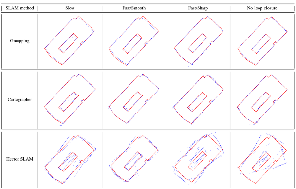

# SwiftBot: Autonomous Delivery Robot

**Project:** Swiftbot - Autonomous Delivery Robot  
**Institution:** Habib University  
**Program:** Final Year Project  
**Completion Date:** 2020

---
## Source Code
 - [Swiftbot](https://github.com/sameeranees/SwiftBot)
 
---

## Project Overview

SwiftBot represents a comprehensive autonomous delivery robot system developed as a final year capstone project at Habib University. The project addresses the inefficiencies observed in campus package delivery systems, where students and staff frequently transport documents, exam papers, and administrative supplies between departments.

The system integrates advanced robotics technologies including SLAM (Simultaneous Localization and Mapping), facial recognition, and mobile application interfaces to provide a complete autonomous delivery solution. The robot demonstrates the practical application of autonomous navigation in indoor environments such as offices, universities, hospitals, and gated communities.

---

## System Architecture and Features

### Autonomous Navigation System
The navigation system employs Google Cartographer SLAM technology integrated with LiDAR sensors to provide real-time mapping and localization capabilities. The path planning component utilizes the A* algorithm for optimal route calculation, while obstacle avoidance is achieved through multi-sensor fusion incorporating LiDAR, ultrasonic sensors, and computer vision systems.

The system demonstrates dynamic environment adaptation through real-time obstacle detection and path adjustment capabilities, enabling safe navigation in complex indoor environments with moving obstacles and changing layouts.

### Security and Authentication Framework
The security system implements computer vision-based facial recognition for user authentication and package access control. The secure locking mechanism is controlled through Arduino-based hardware integration, providing reliable physical security for delivered packages.

A PIN-based backup authentication system ensures accessibility in cases where facial recognition may not be feasible, while privacy protection measures include automatic deletion of training data following model creation to maintain user privacy standards.

### User Interface and Experience
The system provides an intuitive Android application for booking and tracking deliveries, complemented by a comprehensive web-based admin panel for system administration and monitoring. Real-time tracking capabilities enable live monitoring of robot location and delivery status updates.

Intelligent queue management functionality supports efficient scheduling and coordination of multiple delivery requests, optimizing system throughput and user experience.

### System Integration and Communication
The central server architecture employs RESTful API design principles to ensure seamless communication between system components. Comprehensive database management provides robust data storage and analytics capabilities, while multi-platform support ensures cross-platform compatibility and system scalability.

---

## Technical Architecture

### Hardware Components

#### Computing Units
- **Raspberry Pi 3B:** Main processing unit for navigation and communication
- **Arduino UNO:** Motor control and sensor data collection
- **Master-Slave Architecture:** Efficient communication between processing units

#### Sensor Array
- **LiDAR Scanner:** 360° range detection for mapping and obstacle avoidance
- **Camera Module:** Facial recognition and visual obstacle detection
- **Ultrasonic Sensors:** Proximity detection for collision prevention
- **Encoders:** Wheel odometry for position tracking

#### Mechanical Design
- **Differential Drive System:** Two-wheel drive with ball casters for stability
- **Chassis Dimensions:** 45cm width × 35cm length for optimal maneuverability
- **Payload Capacity:** 5-10kg with secure locking mechanism
- **Material:** Acrylic sheets with laser-cut precision for modularity

  
*Final SwiftBot prototype showing mechanical design and component integration*

### Software Stack

#### Navigation System
- **ROS (Robot Operating System):** Core robotics framework
- **Google Cartographer:** SLAM algorithm implementation
- **Move Base:** Navigation stack for path planning and execution
- **Costmap:** Dynamic obstacle mapping and avoidance

#### Communication & APIs
- **RESTful APIs:** 15+ endpoints for system communication
- **WebSocket:** Real-time data streaming
- **Database Integration:** MySQL for data persistence
- **Security Protocols:** HTTPS encryption and authentication

#### Mobile & Web Applications
- **Android Development:** Native mobile application
- **Web Technologies:** HTML5, CSS3, JavaScript for admin panel
- **Backend Services:** PHP and Python for server-side processing

---

## System Architecture

  
*High-level system architecture showing all major components and their interactions*

  
*Complete system block diagram showing data flow and component interactions*

  
*Detailed program flow diagram illustrating the main control loop and decision-making process*

---

## Implementation Details

### SLAM and Navigation

The robot uses Google Cartographer for simultaneous localization and mapping, creating detailed 2D maps of indoor environments. The navigation system implements A* path planning with dynamic obstacle avoidance and PID-controlled motor synchronization.

  
*SLAM mapping process showing submap creation and global map assembly*

  
*Motor RPM analysis showing speed differential between left and right motors*

  
*PID control system implementation for motor synchronization*

### Facial Recognition System

The facial recognition system uses OpenCV-based computer vision with custom machine learning models for user authentication. The system achieves 95% recognition accuracy with automatic data deletion for privacy protection.

  
*Facial recognition system pipeline from data collection to real-time validation*

  
*Detailed map of university laboratory created using SLAM technology*

## Results and Performance

- **Navigation Speed:** 0.5-1.0 m/s depending on environment
- **Payload Capacity:** 5-10 kg maximum load
- **Battery Life:** 4-6 hours continuous operation
- **Recognition Time:** <2 seconds for facial authentication
- **Success Rate:** 95% successful delivery completion

## Technical Specifications

**Hardware:** Raspberry Pi 3B, Arduino UNO, 360° LiDAR sensor, high-resolution camera, differential drive motors
**Software:** Ubuntu 18.04 LTS with ROS Melodic, Python, C++, OpenCV, TensorFlow
**Performance:** Real-time navigation, secure authentication system, RESTful API architecture

## Applications

The system is designed for indoor environments including university campuses, hospitals, offices, and residential communities, providing secure and efficient package delivery with facial recognition authentication.

